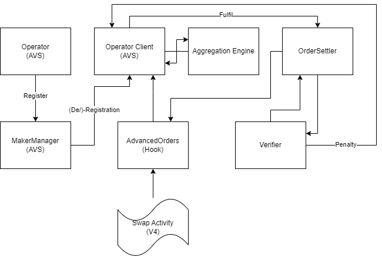

# Advanced Orders Hook for Uniswap V4

One of the core differences between a DEX and a CEX is the types of order you're able to create, with Uniswap V3 supporting market orders as well as (a form of) limit orders with Range Orders. With the introduction of Hooks in Uniswap V4, this hook enables users to place more advanced orders on Uniswap V4 linked to the available liquidity and the current price of the asset.

One of the core aspects of an exchange is efficient execution, since V4 hook allow direct access but do not allow full pool discovery, we use EigenLayer to discover the best price execution available for a specific order and fulfil it using the Uniswap V4 hook.

## EigenLayer Operator Registration

An AVS operator can submit a registration on the `MakerManager`, allowing them to retrieve a list of available pairs with the `AdvancedOrders` hook enabled. The operator must have a stake higher than `minStake` and should have an operator running. The AVS Operator Client can then start looking for tasks on the `MakerManager` contract to start fulfilling them.

The Operator Client aggregates liquidity available in the specific V4 pool as well as other sources to provide the best price execution for the order. The Operator Client then sends the order to the `AdvancedOrders` hook via the `MakerManager` contract, which will execute the order on the Uniswap V4 pool via `OrderSettler` in order to allow execution handover.

### Order Validation

The `AdvancedOrders` hook validates the order and checks if the order is valid and the user has enough balance to execute the order. If the order is valid, the `AdvancedOrders` hook will execute the order on the Uniswap V4 pool via the `OrderSettler` contract.

This also ensures that the operator is acting within their given bounds and unable to fulfil any order that shouldn't be fulfilled. If an anomaly is detected, the order will be rejected and the operator will not be able to fulfil the order.

A separate consistency check is performed via the AVS Verifier which continuously monitors the spread between the actual and execution price to ensure that the operator is acting within the bounds of the order. If the operator is found to be executing orders outside of the bounds, the operator will be penalized via slashing and will no longer be able to fulfil future orders.

This method is significantly more transparent than traditional order execution methods, while allowing full competition between aggregated sources.

## Order Types

The `AdvancedOrders` hook supports the following order types:

- `STOP_LOSS`: The user is able to sell their asset if the price falls below a certain threshold.
- `TAKE_PROFIT`: The user is able to sell their asset if the price rises above a certain threshold.
- `BUY_STOP`: The user is able to buy an asset if the price rises above a certain threshold.
- `BUY_LIMIT`: The user is able to buy an asset if the price falls below a certain threshold.

While all these order types are fairly common on CEX interfaces, they are rarely seen together on DEX interfaces. This hook allows users to place these orders on Uniswap V4, allowing for more advanced trading strategies.
